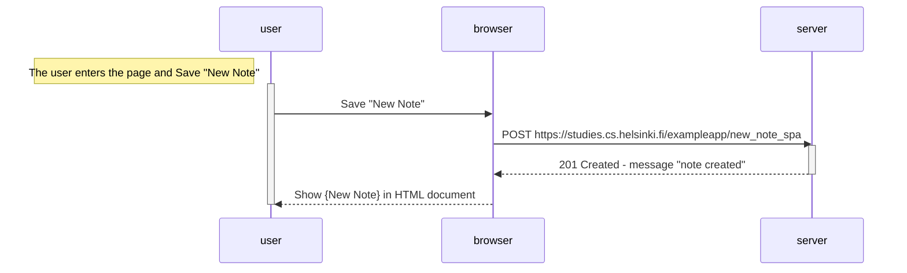

```mermaid
sequenceDiagram
    participant user
    participant browser
    participant server

    Note left of user: The user enters the page and Save "New Note"

    activate user
    user->>browser: Save "New Note"
    browser->>server: POST https://studies.cs.helsinki.fi/exampleapp/new_note_spa
    activate server
    server-->>browser: 201 Created - message "note created"
    deactivate server

    browser-->>user: Show {New Note} in HTML document
    deactivate user

```